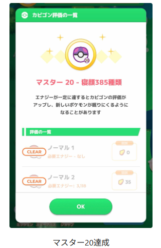
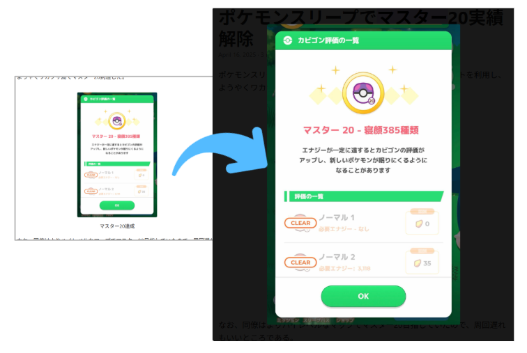
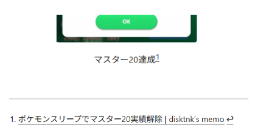
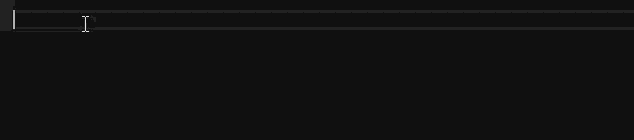

# `image` shortcode for Hugo

Support the following features:

* Display size adjustment
* Caption display
* Fottnotes (`[^N]`) (*)
* Original size display option

(*) Some additional code is required, see below

## shortcodes

```tree
assets/
├── css
│   └── image.css
└── js
    └── image.js

layouts/
├── partials
│   └── extend_head.html (*)
└── shortcodes
    └── image.html

```

(*) add css and js link to `extend_head.html`

```html
{{- if .HasShortcode "image" -}}
{{- $image_css := resources.Get "css/image.css" | resources.Minify }}
<link rel="stylesheet" href="{{ $image_css.RelPermalink }}">
{{- $image_js := resources.Get "js/image.js" | resources.Minify }}
<script src="{{ $image_js.RelPermalink }}"></script>
{{- end -}}
```

### usage

```md

```

Show as



#### Paramters

- **url**: (required) address of image
- **caption**: Caption to display under the image
- **size**: Image display size
- **zoom**: if set to `true`, expands when clicked

if set `zoom=true`, expands when clicked



#### Footnote

Supports footnotes by inserting dummy `<span>` elements.

```md
<span class="hidden-footnote-refs">[^1]</span>


[^1]: [ポケモンスリープでマスター20実績解除 | disktnk's memo](https://disktnk.github.io/posts/2025/04/16_pokemon_sleep_master20/)
```



## VSCode snippet

The following input completion snippets are available. Place `vscode-snippet\markdown.code-snippets` in the project's `.vscode` directory.

- **`hfn`**: Inserting a placeholder `<span>` element
- **`img`**: Inserting an `img` shortcode
- **`imgfn`**: Inserting both a placeholder `<span>` element and an `img` shortcode


